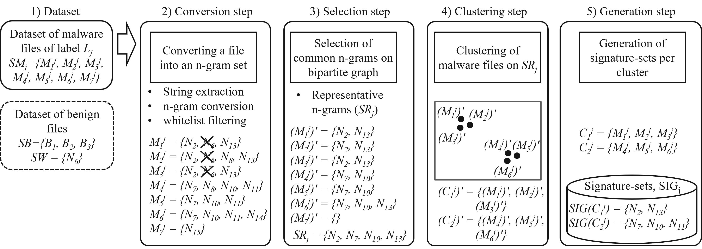

# DIME
> *Detecting Internet-of-Things Malware on Evidence Generation*  
---

<div align=center></div>

We tackle the problem of detecting IoT malware from a new perspective of anti-virus solution users rather than solution developers or product providers. We assume that the users are security experts but not employees of an anti-virus company. Despite recent advanced detection capability of anti-virus solutions, we observe that little evidence explaining the detection is provided to the users; specific conditions or strings triggering the detection are not disclosed by the anti-virus companies. We call this *Malware Detection without Evidence provided*, shortly an *MDE* problem.

We present a new scheme to solve the MDE problem for anti-virus solution users. The new scheme is called *Detecting IoT Malware on Evidence generation*, shortly *DIME*, which can automatically analyze datasets of IoT malware files and generate an unique group of ASCII strings for each of malware types. We argue that the unique group of readable strings can be used as the easy-to-understand detection evidence that has not been achieved by previous work.

# Environment Setup
Use the following command to install the packages:
> pip install -r requirement.txt

# Citation
Please cite the paper if you use the code, here is the Bibtex:
```bibtex
@ARTICLE{10623818,
  author={Han, YoonSeok and Seo, HyungBin and Yoon, MyungKeun},
  journal={IEEE Internet of Things Journal}, 
  title={Detecting Internet-of-Things Malware on Evidence Generation}, 
  year={2024},
  volume={},
  number={},
  pages={1-1},
  keywords={Malware;Security;Internet of Things;Companies;Accuracy;Domain Name System;Deep learning;malware;Internet-of-Things;clustering;bipartite graph;signature generation},
  doi={10.1109/JIOT.2024.3439528}
}
```

# More Info and Notes
Regarding the open datasets used in our experiments in Section IV.
* IoTPOT: https://sec.ynu.codes/iot/available_datasets
* IoTPOT for DIME: https://drive.google.com/file/d/1uuoVgms2KjW0HztXpiA0ztKub6zNxJo1/view?usp=sharing
